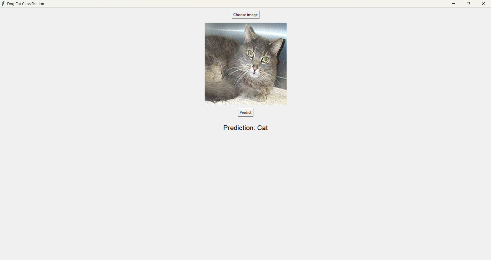
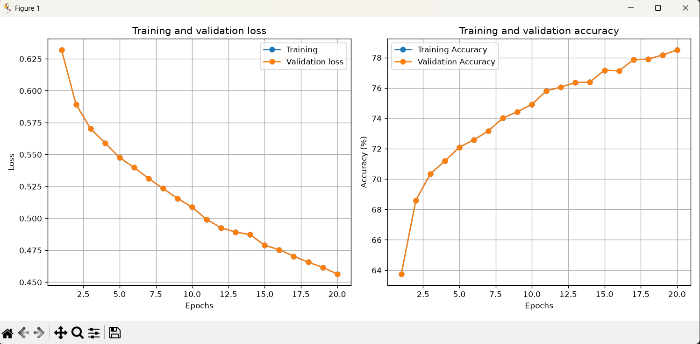
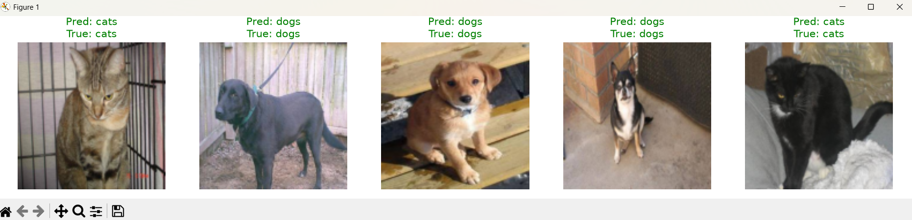

# Cat & Dog Classifier

A binary image classifier built with PyTorch, trained on the Kaggle Dogs vs Cats dataset, with a Tkinter desktop GUI for real-time inference.

---

## Demo

### Desktop GUI

The app lets you pick any image and get a real-time prediction.



### Training Curves

20 epochs, early stopping with patience 5, Adam optimizer + ReduceLROnPlateau scheduler.



### Sample Predictions on Validati
on Set


---

## Results

| Metric | Value |
|---|---|
| Best validation accuracy | **78.50%** (epoch 20) |
| Best validation loss | **0.4530** |
| Final loss (best model) | 0.4507 |
| Model parameters | 16,783,938 |
| Training epochs | 20 (no early stop triggered) |
| Classes | `cats` (0), `dogs` (1) — alphabetical via `ImageFolder` |

Training log excerpt:

```
Epoch  1 | Train Loss: 0.6318 Acc: 63.75% | Val loss: 0.5925 Acc: 70.30%
Epoch 10 | Train Loss: 0.5087 Acc: 74.92% | Val loss: 0.5045 Acc: 74.65%
Epoch 20 | Train Loss: 0.4564 Acc: 78.50% | Val loss: 0.4530 Acc: 77.75%
Training complete - best val accuracy: 78.50%
```

---

## Project Structure

```
cat_dog_classifier/
├── model.py      # DogCatCNN architecture (BatchNorm + Dropout) + load_model()
├── data.py       # Transforms and get_dataloaders()
├── trainer.py    # train(), evaluate(), plot_history(), visualize_predictions()
├── train.py      # Main entrypoint — run this to train
├── GUI.py        # Tkinter desktop app for inference
├── log.py        # Logger + history saver (writes to logs/)
├── assets/       # Demo screenshots used in this README
└── requirements.txt
```

## How to Run

**Train:**
```bash
python train.py
```
Expects data at `./data/train` and `./data/valid` (ImageFolder format: one subfolder per class).

**Run GUI:**
```bash
python GUI.py
```
Expects `best_model.pth` in the same directory.

## Architecture

- 2 convolutional blocks (Conv2d → BatchNorm2d → ReLU → MaxPool)
- Hidden FC layer (32768 → 512) with Dropout(0.5)
- Output FC layer (512 → 2)
- Adam optimizer, ReduceLROnPlateau scheduler
- Data augmentation: random horizontal flip + rotation (train only)

## A Bug Worth Knowing About

`ImageFolder` assigns class indices **alphabetically**, not in the order you list them. Since `cats` < `dogs` alphabetically, the training pipeline always assigns `cats = 0` and `dogs = 1` — regardless of folder creation order.

The GUI originally had `CLASS_NAMES = ['Dog', 'Cat']` (dog first), which silently mismatched the model's actual index order and flipped every prediction. Fixed by aligning the GUI's class list to match `train_loader.dataset.classes` exactly:

```python
CLASS_NAMES = ['Cat', 'Dog']  # cats=0, dogs=1 — matches ImageFolder order
```

## Requirements

```
torch>=2.0.0
torchvision>=0.15.0
matplotlib>=3.7.0
numpy>=1.24.0
Pillow>=9.5.0
```
