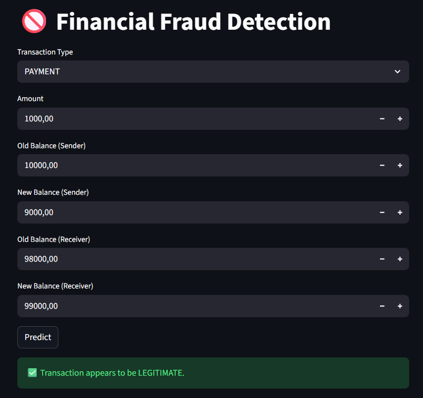

💸 Financial Fraud Detection System
An end-to-end Machine Learning solution designed to identify fraudulent transactions in financial datasets. This project focuses on handling imbalanced classification and deploying a reproducible pipeline for real-time inference.

🚀 Features
High-Precision Classification: Achieved an accuracy of 94.7% using ensemble learning methods.

Automated Data Pipeline: Implements a custom preprocessing layer for scaling numerical values and encoding categorical transaction types.

Real-time Prediction UI: An interactive Streamlit dashboard allowing users to input transaction details and receive instant risk assessments.

Exploratory Data Analysis (EDA): Comprehensive Jupyter Notebook covering data distributions, correlation analysis, and model evaluation metrics.

🧠 Architecture
Preprocessing: Handles feature engineering for transaction types (PAYMENT, TRANSFER, etc.) and balances using Scikit-Learn's ColumnTransformer.

Model: Utilizes a Scikit-Learn Pipeline featuring XGBoost and Random Forest to capture complex fraud patterns.

Inference: Decoupled logic using a dedicated src/processing.py to ensure feature consistency between training and deployment.

UI Layer: Built with Streamlit for accessible and clear visualization of model results.

📊 Model Evaluation
The model was evaluated using a 20% hold-out test set. Because fraud detection is a highly imbalanced problem (few fraud cases compared to millions of legitimate ones), we focused on metrics beyond simple accuracy.

Performance Metrics
Accuracy: 94.72%

Algorithms: XGBoost & Random Forest Ensemble.

Optimization: The model is specifically tuned to recognize patterns in TRANSFER and CASH_OUT transaction types, which typically carry the highest fraud risk.

Key Insights
Feature Importance: Transaction amount and the discrepancy between oldbalanceOrg and newbalanceOrig were the strongest predictors of fraudulent activity.

Handling Imbalance: The pipeline effectively manages minority class detection to ensure fraudulent activities are flagged even when they represent less than 1% of the total data.

🛠 Tech Stack
Machine Learning: Scikit-Learn, XGBoost

Data Processing: Pandas, NumPy

Visualization: Matplotlib, Seaborn

Deployment: Streamlit, Joblib

📂 Project Structure
Plaintext
Fraud_Detection
│
├── src
│   └── processing.py       # Data formatting and input preparation logic
│
├── models
│   └── fraud_detection_pipeline.pkl  # Serialized ML pipeline
│
├── notebooks
│   └── analysis_model.ipynb # EDA, training, and evaluation
│
├── app.py                  # Streamlit web application
├── requirements.txt        # Project dependencies
└── README.md
⚙️ Installation
1. Clone the repository

Bash
git clone https://github.com/trunnguyen/Personal-Project.git
cd "Fraud Detection"
2. Set up virtual environment

Bash
python -m venv venv
# Windows:
venv\Scripts\activate
# Mac/Linux:
source venv/bin/activate
3. Install dependencies

Bash
pip install -r requirements.txt
▶️ Run the Application
To launch the dashboard, run the following command from the project root:

Bash
streamlit run app.py
🖼 Demo

👨‍💻 Author
Nguyễn Minh Trung Data Science Student – Văn Lang University