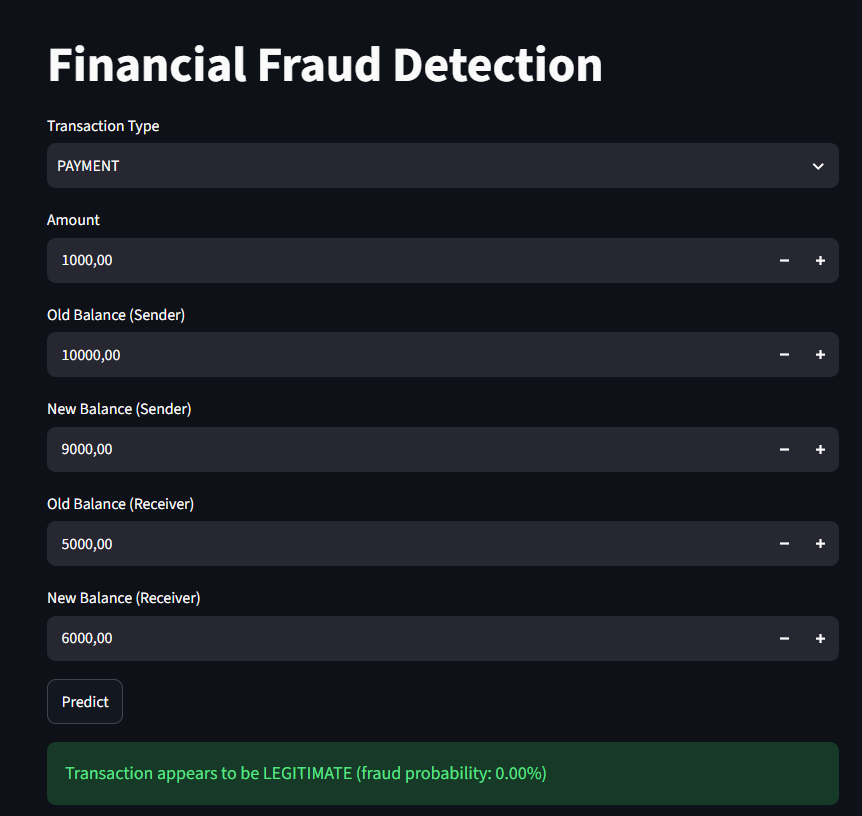
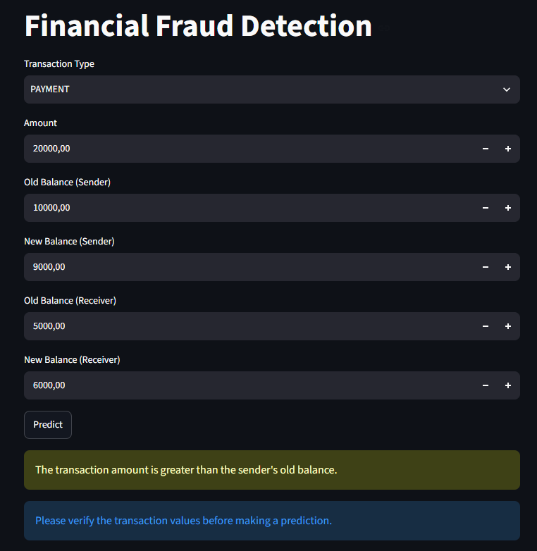
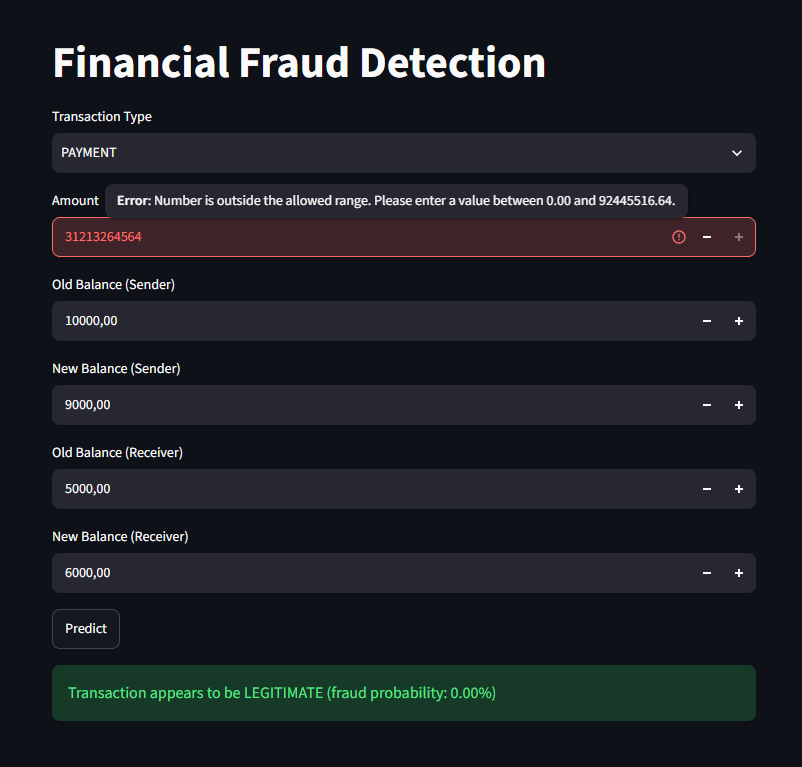

# Financial Fraud Detection System

An end-to-end machine learning application for detecting potentially fraudulent financial transactions. The project covers data exploration, feature engineering, preprocessing, model training, evaluation, and deployment through a Streamlit application.

## Project Overview

This project uses transaction data to build a classification pipeline for identifying potentially fraudulent transactions.

The system analyzes:

- Transaction type
- Transaction amount
- Sender balance before and after the transaction
- Receiver balance before and after the transaction
- Engineered balance-difference features

The project focuses on building a reproducible machine learning pipeline and deploying it as an interactive application.

## Key Features

- Exploratory data analysis of transaction and fraud patterns
- Feature engineering for sender and receiver balance differences
- Numerical feature standardization
- Categorical feature encoding
- Class-balanced Logistic Regression
- Stratified train/test split
- Precision, recall, F1-score, and accuracy evaluation
- Confusion matrix visualization
- Fraud probability estimation
- Input validation and range checking
- Serialized Scikit-learn prediction pipeline
- Interactive Streamlit application

## Machine Learning Pipeline

```text
Transaction Data
       │
       ▼
Data Exploration
       │
       ▼
Feature Engineering
       │
       ├── balanceDiffOrig
       └── balanceDiffDest
       │
       ▼
Preprocessing
       │
       ├── StandardScaler
       └── OneHotEncoder
       │
       ▼
Logistic Regression
(class_weight="balanced")
       │
       ▼
Model Evaluation
       │
       ├── Precision
       ├── Recall
       ├── F1-score
       ├── Accuracy
       └── Confusion Matrix
       │
       ▼
Serialized Pipeline
       │
       ▼
Streamlit Application
```

## Feature Engineering

Two additional features are calculated from the transaction balances:

### Sender Balance Difference

```text
balanceDiffOrig = oldbalanceOrg - newbalanceOrig
```

### Receiver Balance Difference

```text
balanceDiffDest = oldbalanceDest - newbalanceDest
```

These features are generated consistently during both model training and application-time prediction.

## Model Training

The project uses a Scikit-learn `Pipeline` combining preprocessing and classification.

### Numerical Features

- `amount`
- `oldbalanceOrg`
- `newbalanceOrig`
- `oldbalanceDest`
- `newbalanceDest`
- `balanceDiffOrig`
- `balanceDiffDest`

Numerical features are standardized using `StandardScaler`.

### Categorical Features

Transaction type is encoded using `OneHotEncoder`.

### Classifier

The final classifier is:

**Logistic Regression with balanced class weights**

```python
LogisticRegression(
    class_weight="balanced",
    max_iter=1000,
    random_state=42
)
```

Using balanced class weights helps account for the class imbalance commonly found in fraud detection datasets.

## Model Evaluation

The model is evaluated using a stratified 70/30 train-test split.

Evaluation metrics include:

- Precision
- Recall
- F1-score
- Accuracy
- Confusion Matrix

Precision, recall, and F1-score are included alongside accuracy because fraud detection involves an imbalanced classification problem where accuracy alone may not provide a complete picture of model performance.

## 🖥Streamlit Application

The trained pipeline is serialized using Joblib and loaded by the Streamlit application.

The application allows users to enter:

- Transaction type
- Transaction amount
- Sender balances
- Receiver balances

The application then:

1. Validates the input values.
2. Calculates the engineered features.
3. Passes the transaction through the trained pipeline.
4. Predicts whether the transaction is potentially fraudulent.
5. Displays the model's estimated fraud probability.

### Input Validation

The application includes basic validation to prevent unrealistic inputs, including:

- Negative financial values
- Values exceeding the observed dataset ranges
- Transaction amounts greater than the sender's available balance for applicable transaction types

Validation warnings are shown before a prediction is made.

## Technologies

### Programming & Data Processing

- Python
- Pandas
- NumPy

### Machine Learning

- Scikit-learn
- Logistic Regression

### Visualization

- Matplotlib
- Seaborn

### Deployment

- Streamlit
- Joblib

## Project Structure

```text
Fraud Detection/
│
├── DEMO/
│   ├── prediction.png
│   ├── validation.png
│   └── input_validation.png
│
├── models/
│   └── fraud_detection_pipeline.pkl
│
├── notebooks/
│   └── analysis_model.ipynb
│
├── src/
│   ├── __init__.py
│   └── processing.py
│
├── app.py
├── requirements.txt
└── README.md
```

## 🖼️ Application Demo

### Normal Prediction



### Transaction Validation



### Input Range Protection



## Installation

### 1. Clone the repository

```bash
git clone https://github.com/trunnguyen/Personal-Project.git
cd "Fraud Detection"
```

### 2. Create a virtual environment

```bash
python -m venv .venv
```

Activate it on Windows:

```bash
.venv\Scripts\activate
```

### 3. Install dependencies

```bash
pip install -r requirements.txt
```

## Run the Application

```bash
streamlit run app.py
```

The application will open in your browser.

## Project Workflow

The complete workflow is:

```text
Data
 ↓
Exploratory Analysis
 ↓
Feature Engineering
 ↓
Preprocessing Pipeline
 ↓
Model Training
 ↓
Model Evaluation
 ↓
Model Serialization
 ↓
Streamlit Deployment
```

## Author

**Nguyễn Minh Trung**

Data Science Student — Văn Lang University
