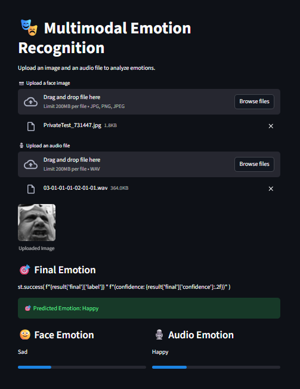

🎭 Multimodal Emotion Recognition System
An end-to-end deep learning application that performs real-time emotion classification by fusing visual and auditory data. The system utilizes a dual-stream architecture to process facial expressions and speech patterns simultaneously to resolve modality conflicts based on statistical confidence.

🚀 Features
Dual-Stream Inference: Parallel processing of images and audio files.

Late-Fusion Strategy: A custom decision layer that integrates predictions from multiple models.

Feature Extraction: Automated 40-dimensional MFCC extraction for audio and grayscale normalization for face images.

Interactive UI: A Streamlit dashboard with real-time confidence meters for each modality.

🧠 Architecture
Vision Stream: A 2D-CNN trained on the FER2013 dataset for facial expression recognition.

Audio Stream: An LSTM network trained on the RAVDESS dataset for speech emotion classification.

Late Fusion: A decision-level integration layer that determines the final emotion based on the confidence of both streams.

UI Layer: A Streamlit engine for file uploading and synchronized sentiment prediction.

🛠 Tech Stack
Python

PyTorch (CNN & LSTM)

OpenCV (Vision processing)

Librosa (Audio/MFCC extraction)

Streamlit (Web interface)

NumPy & Pandas

📂 Project Structure
Plaintext
Multimodal_emotion_recognition
│
├── configs
│   └── config.yml           # Hyperparameters and model paths
├── Data
│   ├── processed            # .npy files for training
│   └── raw                  # FER2013 and RAVDESS datasets
├── inference
│   ├── audio_infer.py       # Audio feature processing
│   ├── face_infer.py        # Image preprocessing
│   └── pipeline.py          # Multimodal late-fusion logic
├── models
│   ├── face_emotion         # FaceCNN architecture & weights
│   ├── speech_emotion       # SpeechLSTM architecture & weights
│   └── fusion               # Late-fusion decision logic
├── ui
│   └── app.py               # Streamlit application
└── requirements.txt
⚙️ Installation
1. Clone the repository

Bash
git clone https://github.com/trunnguyen/Personal-Project.git
cd Multimodal_emotion_recognition
2. Create & activate virtual environment

Bash
python -m venv venv
# Windows
venv\Scripts\activate
3. Install dependencies

Bash
pip install -r requirements.txt
▶️ Run the Application
To ensure the application correctly locates the internal modules, run Streamlit from the project root:

Bash
streamlit run ui/app.py
🖼 Demo

👨‍💻 Author
Nguyễn Minh Trung Data Science Student – Văn Lang University