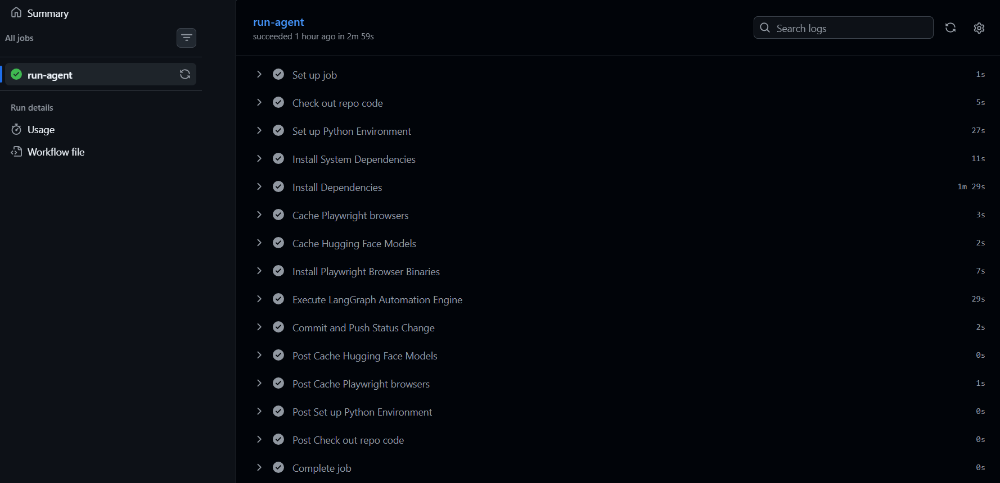
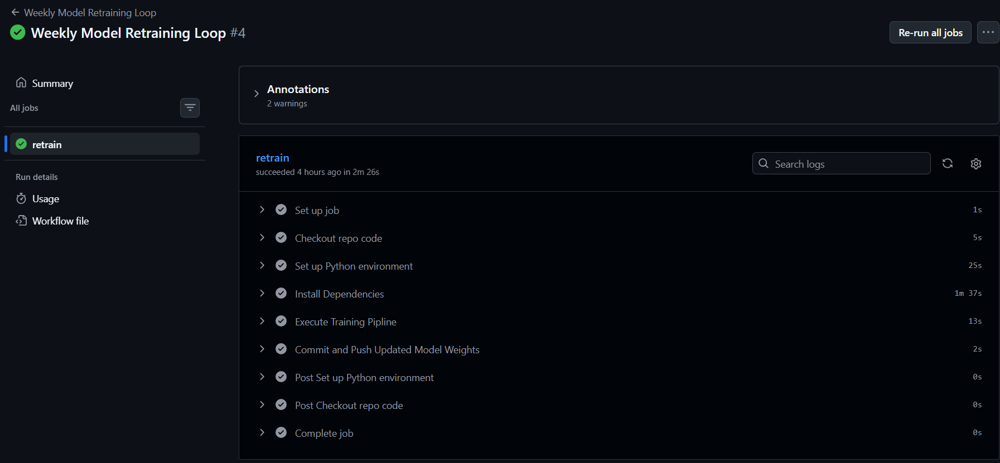
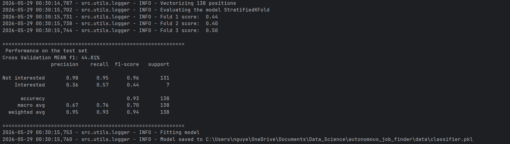
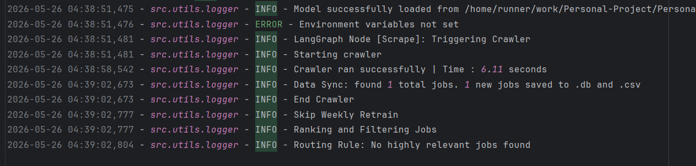

# Autonomous AI/ML Job-Hunting Agent

> A production-ready automation pipeline that scrapes, scores, and forecasts AI/ML internship opportunities in **Ho Chi Minh City** — fully hands-free via GitHub Actions.

---

## Overview

This agent runs on a daily GitHub Actions cron schedule. It crawls LinkedIn for fresh AI/ML intern postings, semantically scores each one against your profile, and emails you only the roles that clear the relevance threshold — every Tuesday and Friday. Your feedback in the Streamlit dashboard continuously improves the scorer over time.


---

## Key Features

**Stateful Agentic Orchestration** — A `LangGraph` `StateGraph` sequences four explicit nodes: `scrape_linkedin → retrain_node → ranking_job → dispatch_alert`. Conditional routing on the final edge decides whether to alert or terminate silently based on the day of week and match count.

**Asynchronous Web Scraping** — `crawl4ai`'s `AsyncWebCrawler` with randomized user agents and a `playwright` headless Chromium backend. Rotates across five search keywords daily and deduplicates inserts via `INSERT OR IGNORE` on the job URL.

**Dual-Stage ML Scorer** — Cold-start mode uses cosine similarity against an expanded anchor profile via `all-MiniLM-L6-v2` SBERT embeddings (threshold `0.25`). Once `classifier.pkl` exists the pipeline promotes to a `LogisticRegression` classifier trained on your own feedback (threshold `0.4`)

**Accumulated Reporting** — Jobs are scored and stored silently every day. On reporting days (Tuesday/Friday) the email covers all high-match jobs found **since the last report**, not just that day's scrape — tracked via a `meta` table with a `last_reported_at` timestamp.

**Weekly Model Retraining** — `training_pipeline.py` runs Stratified 3-Fold cross-validation, prints a full `classification_report`, then serializes the updated weights to `classifier.pkl` — triggered every Sunday via `retrain_model.yml` and committed back to the repository automatically.

**Market Forecasting** — `forecaster.py` queries daily posting counts from SQLite and passes them to Facebook `Prophet` to predict posting volume over a rolling 14-day window (lower, mid, upper bounds). Requires at least 5 distinct days of data to activate.

**Interactive Streamlit Dashboard** — Displays the forecast chart, lists all tracked jobs with AI scores, and lets you toggle interest state per listing. State changes write back to `jobs.db` and sync to `jobs.csv` immediately.

**Full-Loop Email Actions** — High-match emails contain a `Mark as Applied` button that fires a GitHub Repository Dispatch webhook (`mark_job_applied`), which triggers `status_updater.yml` to set `is_applied = 1` in the database without any manual steps.

**Environment Validation** — `validate_env()` runs at startup and aborts immediately with a clear log message if any required secret is missing or empty, preventing cryptic mid-run failures.

---

## Project Structure

```
.github/
└── workflows/
    ├── job_hunter.yml          # Daily scrape, score, alert, commit jobs.db
    ├── retrain_model.yml       # Weekly retrain, commit classifier.pkl
    └── status_updater.yml      # repository_dispatch listener → set is_applied=1

autonomous_job_finder/
├── data/
│   ├── classifier.pkl          # Serialized LogisticRegression weights
│   ├── jobs.csv                # Flat-file backup (auto-exported after every write)
│   ├── jobs.db                 # Core SQLite database
│   └── job_history.log         # Unified runtime audit log
├── src/
│   ├── scraper/
│   │   └── crawler.py          # Async LinkedIn crawler with keyword rotation
│   ├── agent/
│   │   ├── graph.py            # LangGraph StateGraph — nodes, edges, routing
│   │   ├── notifier.py         # HTML email builder & SMTP dispatcher
│   │   └── .env                # Secrets (not committed)
│   ├── analytics/
│   │   ├── job_recommender.py  # SBERT cold-start + LR warm-start inference
│   │   ├── training_pipeline.py# Stratified K-Fold trainer & model serializer
│   │   └── forecaster.py       # Prophet 14-day posting-volume forecaster
│   └── utils/
│       ├── db_manager.py       # SQLite CRUD — upsert, score, interest, export
│       └── logger.py           # File + console logging (data/job_history.log)
├── dashboard/
│   └── app.py                  # Streamlit job board & forecast dashboard
├── docker-compose.yml          # Two services: agent_backend + dashboard_ui
├── Dockerfile                  # python:3.11-slim + Playwright Chromium
├── requirements.txt
└── main.py                     # Long-running daemon (3-day cycle, asyncio loop)
```

---

## Tech Stack

| Layer | Libraries |
|---|---|
| Workflow Orchestration | `langgraph`, `langchain-core` |
| Web Scraping | `crawl4ai`, `playwright`, `beautifulsoup4` |
| Machine Learning | `scikit-learn`, `sentence-transformers`, `torch`, `numpy`, `pandas` |
| Time-Series Forecasting | `prophet` |
| Frontend Dashboard | `streamlit` |
| Database | `sqlite3` |
| Notifications | `smtplib`, `python-dotenv` |

---

## Screenshots

**Interactive Streamlit Dashboard**

Tracks market trends, displays AI scores per listing, and drives the labeling feedback loop.

.png)
.png)

**GitHub Actions CI/CD**

Daily cron run configuring dependencies, executing the LangGraph pipeline, and committing `jobs.db` back to the repository.



**Weekly Model Retraining Workflow**

Retraining pipeline completing successfully in 2m 26s — training on labeled feedback and committing updated weights back to the repository.



**ML Training Pipeline**

Stratified 3-Fold cross-validation output verifying classifier quality before weight serialization.



**Production Audit Log**

Unified runtime logs from `data/job_history.log` generated during automated execution.



---

## Getting Started

### Prerequisites

- Python 3.11+
- Docker & Docker Compose *(optional)*
- A Gmail account with an [App Password](https://support.google.com/accounts/answer/185833) enabled

### Configuration

Create `src/agent/.env`:

```env
SMTP_SERVER=smtp.gmail.com
SMTP_PORT=587
EMAIL_ADDRESS=your_account@gmail.com
EMAIL_PASSWORD=xxxx_xxxx_xxxx_xxxx
GITHUB_TOKEN=ghp_YourGitHubPersonalAccessToken
```

> ⚠️ No spaces around `=` and no quotes around values. A space like `SMTP_PORT= 587` will cause a startup failure.

---

### Option 1 — Local Virtual Environment

```bash
# Create and activate virtual environment
python -m venv venv
source venv/bin/activate        # Windows: venv\Scripts\activate

# Install dependencies
pip install -r requirements.txt

# Install Playwright Chromium binaries
python -m playwright install chromium --with-deps

# Launch the dashboard
streamlit run dashboard/app.py

# Or run the full agent loop (3-day cycle daemon)
python main.py
```

### Option 2 — Docker Compose

Spins up two containers: `agent_backend` (daemon loop) and `dashboard_ui` (Streamlit).

```bash
docker-compose up --build
```

Dashboard available at `http://localhost:8501`. Both containers share the `./data` volume.

---

## Architecture Deep Dive

### 1. Startup Validation — `graph.py`
 
Before the pipeline starts, `validate_env()` checks all required secrets are present and non-empty:
 
```python
REQUIRED_ENV = ["SMTP_SERVER", "SMTP_PORT", "EMAIL_ADDRESS", "EMAIL_PASSWORD", "GITHUB_TOKEN"]
 
def validate_env():
    missing = [k for k in REQUIRED_ENV if not os.getenv(k, "").strip()]
    if missing:
        raise EnvironmentError(f"Aborting: missing env vars {missing}")
```
 
If anything is missing the run aborts immediately with a clear log message rather than failing mid-pipeline.

### 2. Data Ingestion — `crawler.py`

On each run, one keyword is randomly selected from the pool (`AI Intern`, `Machine Learning Intern`, `Data Science Intern`, `Data Engineer Intern`, `Data Analyst Intern`) and used to build a LinkedIn public jobs search URL. `AsyncWebCrawler` fetches the page with a random user agent and a 5-second render delay to allow JavaScript to settle. Job cards are parsed via `div.base-card` selectors and inserted into SQLite with `INSERT OR IGNORE` (keyed on `job_url`) to prevent duplicates. The database is immediately exported to `jobs.csv` after every successful write.

### 3. State Routing — `graph.py`

The pipeline state flows through a typed dictionary:

```python
class AgentState(TypedDict):
    found_jobs: List[Dict[str, Any]]
    unfound_jobs: List[Dict[str, Any]]
    highly_relevant_jobs: List[Dict[str, Any]]
```

Node sequence: `scrape_linkedin → retrain_node → ranking_job`, then a conditional edge decides the final step. If today is Tuesday (1) or Friday (4) **and** at least one job cleared the score threshold, the pipeline routes to `dispatch_alert`. Otherwise it terminates at `END`. The `retrain_node` only executes the training loop on Sundays (weekday `6`); on all other days it passes state through unchanged.

### 4. Dual-Stage Recommender — `job_recommender.py` & `training_pipeline.py`

**Cold Start:** Each job is converted to a plain text string (`"Job Opportunity {title} at {company} located in {location}"`), encoded by `all-MiniLM-L6-v2`, and compared against a fixed anchor vector via cosine similarity. Threshold for high-match routing: `0.3`.

**Warm Mode:** Once `classifier.pkl` exists (written by `training_pipeline.py`), `Recommender` loads it on init and switches to `predict_proba` output. Threshold rises to `0.7`.

**Training trigger:** `training_pipeline.py` reads all jobs from the database, builds labels from `is_applied`, and requires a minimum of 3 positive and 3 negative examples before proceeding. It runs Stratified 3-Fold CV, logs per-fold F1 scores and a full `classification_report`, then fits a final `LogisticRegression(class_weight='balanced')` on the full dataset and serializes it.

### 5. Accumulated Reporting — `db_manager.py`
 
Jobs are scored silently every day and stored in `jobs.db`. On reporting days, `score_node` queries only jobs found since the last report:
 
```python
def get_high_matches_since(self, threshold, since_date):
    cursor.execute("""
        SELECT * FROM jobs
        WHERE ai_score >= ? AND is_applied = 0 AND date_found >= ?
        ORDER BY ai_score DESC
    """, (threshold, since_date))
```
 
After `alert_node` sends the email it stamps the current time into a `meta` table:
 
```python
def set_last_reported_date(self, date_str):
    conn.execute("INSERT OR REPLACE INTO meta (key, value) VALUES ('last_reported_at', ?)", (date_str,))
```
 
This ensures each report covers exactly the window since the last one — no duplicates, no missed jobs.

### 6. Email Notifier — `notifier.py`

For each high-match job, an HTML email card is built containing the job title, company, match score, a link to the original posting, and a `Mark as Applied` button. That button links to:

```
https://github.com/trunnguyen/Personal-Project/issues/new?title=Applied+to+Job+{id}&body=mark_applied:{id}
```

Clicking it fires a `repository_dispatch` event (`mark_job_applied`) which `status_updater.yml` picks up to update the database row.

### 7. Market Forecaster — `forecaster.py`

Aggregates daily posting counts:

```sql
SELECT date(date_found) AS ds, COUNT(id) AS y FROM jobs GROUP BY ds
```

With 5+ data points, a `Prophet` model is fit with yearly and daily seasonality disabled, then used to generate a 14-day forward forecast. The dashboard renders `yhat`, `yhat_lower`, and `yhat_upper` as a line chart.

---

## GitHub Actions Workflows

| Workflow | Trigger | What it does |
|---|---|---|
| `job_hunter.yml` | Daily @ 01:00 UTC | Installs deps + Chromium, runs `graph.py`, commits `jobs.db`, `jobs.csv`, `job_history.log` |
| `retrain_model.yml` | Sundays @ 00:00 UTC | Runs `training_pipeline.py`, commits updated `classifier.pkl` |
| `status_updater.yml` | `repository_dispatch: mark_job_applied` | Calls `db.update_score_and_interest(job_id, is_applied=1)`, commits `jobs.db` + `jobs.csv` |

All three workflows use `git stash → pull --rebase → stash pop` to handle concurrent write conflicts cleanly before pushing.

