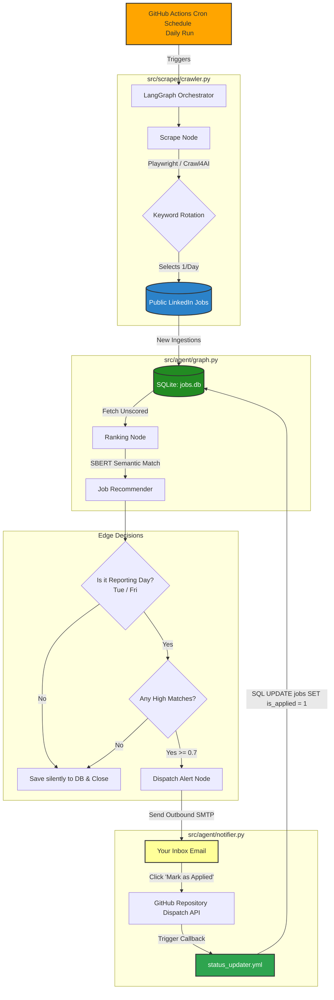

# 🤖 Autonomous AI/ML Job-Hunting Agent

An intelligent, production-ready automation ecosystem engineered to seamlessly scrape, evaluate, and forecast localized employment opportunities. Specifically optimized for identifying **AI/ML Intern roles in Ho Chi Minh City**, this application orchestrates a continuous feedback loop between raw web data and machine learning-powered recommendations.

## 🚀 Key FeaturesStateful Agentic Orchestration: 

Structured decision nodes and conditional routing defined via langgraph to cleanly transition from ingestion to scoring and alerting.

Asynchronous Web Scraping: Driven by crawl4ai and playwright utilizing targeted CSS evaluation rules to bypass client-side anti-scraping blocks seamlessly.

Adaptive Dual-Stage ML Scorer: Transitions dynamically from a cold-start embedding text matcher (SentenceTransformer) to a custom personalized binary classifier (LogisticRegression) built on your labeled historical choices.

Predictive Market Forecasting: Built-in time-series forecasting via Facebook's prophet package to predict posting density fluctuations over rolling 14-day tracking horizons.

Full-Loop Interactive Dashboard: A functional streamlit frontend rendering core market tracking metrics, forecasting charts, and a user feedback loop to label jobs instantly.

Hands-Free CI/CD Architecture: Tri-tier GitHub Workflows managing routine execution runs, automated repository database commits, background retraining, and programmatic repository dispatch status handlers.

## 📂 System Directory

github/
└── workflow/
    ├── job_hunter.yml          # Triggers daily scheduled crawlers & LangGraph flows
    ├── retrain_model.yml       # Schedules weekly continuous model parameter updates
    └── status_updater.yml      # Listens for repository dispatch webhooks from email actions
Autonomous-hunter-agent/
├── data/                       # Persistent File-System Volume
│   ├── classifier.pkl          # Serialized Logistic Regression weights & model object
│   ├── jobs.csv                # Flat-file operational backup database dump
│   ├── jobs.db                 # Core transactional SQLite relational database storage
│   └── job_history.log         # Production system runtime logs
├── src/
│   ├── scraper/
│   │   └── crawler.py          # Asynchronous index crawler utilizing multi-keyword rotation
│   ├── agent/
│   │   ├── graph.py            # Main StateGraph orchestration workflow & node mappings
│   │   ├── notifier.py         # Multi-part HTML mail drafting & SMTP transfer execution
│   │   └── .env                # Secure access keys, email configurations, and secrets
│   ├── analytics/
│   │   ├── job_recommender.py  # Model inference loader (SBERT + Anchor-Similarity/LR)
│   │   ├── training_pipeline.py# Stratified K-Fold validator & weight optimization pipeline
│   │   └── forecaster.py       # Time-series prophet analytics worker engine
│   └── utils/
│       ├── db_manager.py       # Relational SQLite transactional CRUD management
│       └── logger.py           # Unified formatted console & file stream layout
├── dashboard/
│   └── app.py                  # Live analytical Streamlit interactive user interface
├── docker-compose.yml          # Orchestration layer grouping backend and dashboard nodes
├── Dockerfile                  # Slim Debian baseline building the Python + Playwright context
├── requirements.txt            # System dependencies tracking structural library pinning
└── main.py                     # Long-lived deployment worker daemon (3-day cycle ticker)

## 🛠️ Core Tech Stack

Workflow Logic: langgraph, langchain-core

Data Scrapers: crawl4ai, playwright, beautifulsoup4

Machine Learning Engine: scikit-learn, sentence-transformers, torch, numpy, pandas

Time Series Analytics: prophet

Frontend UI Component: streamlit

Database Management: sqlite3

## 📸 System Demos & Execution Logs

Interactive Streamlit Dashboard Loop
Provides deep insights into market patterns while supplying the vital UI loop for tracking, application state toggles, and label building.

.png)

.png)
#
Continuous Integration Automation Engine
Runs on a daily cron schedule to configure dependencies, execute the core ingestion loop, and synchronize updates.

#
Machine Learning Training Pipeline Telemetry

Evaluates training pass data quality through Stratified 3-Fold cross-validation splits to verify performance scores before finalizing weights.

Operational Production System Audit Log

Unified execution logs generated during automated background routing steps.

## 📦 Setting Up Locally

### **Prerequisites**

Python 3.11+.
Docker & Docker Compose (Optional, for containerized deployment).
An active email account with SMTP application-specific passwords generated.

### Initial Configuration

Create a private application secrets layer configuration file at src/agent/.env mapping these attributes:

SMTP_SERVER=smtp.gmail.com
SMTP_PORT=587
EMAIL_ADDRESS=your_account@gmail.com
EMAIL_PASSWORD=xxxx_xxxx_xxxx_xxxx
GITHUB_TOKEN=ghp_YourGitHubPersonalAccessToken

## Option 1: Native Virtual Environment Installation

Bash
### Provision virtual runtime boundaries
python -m venv venv
source venv/bin/activate  # On Windows use: venv\Scripts\activate

### Install locked production matrix dependency nodes
pip install -r requirements.txt

### Download required headless system browser binaries
python -m playwright install chromium --with-deps

### Spin up the Interactive Management Panel
streamlit run dashboard/app.py

## Option 2: Docker-Compose Global Containerization

Build and provision the multi-service network stack (encapsulating both the daemon agent loop background container and the active Streamlit app layer) simultaneously:
Bash
docker-compose up --build
Your analytics panel will be accessible at http://localhost:8501.

## ⚙️ Core Architecture & Operational Deep Dive

#### 1. Data Ingestion Pipeline (crawler.py)

Utilizes AsyncWebCrawler from crawl4ai to scrape job postings using rotated search terms (AI Intern, Machine Learning Intern, etc.). It isolates target HTML structural rows using strict CSS patterns (.jobs-search__results-list, div.base-card), parses relevant attributes, and pushes them safely into the database via INSERT OR IGNORE constraints to prevent item duplication.

#### 2. State Routing Loop (graph.py)

Manages stateful progression using an index structural layout payload mapping explicit typed arrays:

Python
    class AgentState(TypedDict):
    found_jobs: List[Dict[str, Any]]
    unfound_jobs: List[Dict[str, Any]]
    highly_relevant_jobs: List[Dict[str, Any]]

- Dynamic Decision Edge: Includes conditional routing rules (route_decision_edge). If execution falls on designated alert windows (Tuesdays/Fridays) and features cross acceptable threshold matches ($\ge 0.70$), the state transfers instantly to dispatch_alert. Otherwise, it logs metrics silently to save compute cycles and signals a graceful termination node step (END).

#### 3. Dual-Stage Recommender (job_recommender.py & training_pipeline.py)

Cold Start Phase: When the database lacks sufficient interaction data, rankings rely on the cosine similarity of text vectors against a localized baseline string profile using the all-MiniLM-L6-v2 embedding model.

Warm Production Handover: Once you interact with roles on the dashboard and mark jobs as interested, db_manager.py switches the tracking record (is_applied = 1).

Online Training Loop: When a balanced set of feedback vectors exists (minimum 3 positive, 3 negative items), training_pipeline.py executes an online optimization pass. It checks predictive quality through a Stratified 3-Fold cross-validation split, trains a customized LogisticRegression model, and saves the refined weights into classifier.pkl.

#### 4. Direct Webhook Ingestion Notifier (notifier.py)

When high-scoring matches surface, the system sends an HTML email newsletter containing direct tracking action triggers. These hyperlinks route directly back into your GitHub Repository Dispatch endpoint:
Plaintext
[https://github.com/your-username/your-repo/issues/new?title=Applied+to+Job](https://github.com/your-username/your-repo/issues/new?title=Applied+to+Job)+<id>&body=mark_applied:<id>
Clicking the action link logs an instantaneous external tracking response payload to trace applied pipelines automatically.

#### 5. Trend Analytics Forecaster (forecaster.py)

The system aggregates metrics directly from SQLite database rows using time-series parsing patterns:

$$\text{SELECT date(date_found) as ds, COUNT(id) as y FROM jobs GROUP BY ds}$$

Once 5 distinct active daily historical points compile, it passes dataframes into a Prophet time-series regression instance. This forecasts lower, upper, and mean estimated job-posting density ranges across a rolling 14-day market horizon window.

## 🤖 Remote Automated GitHub Actions Workflows

The automation system relies on three interconnected workflows located in your .github/workflows/ directory:

1. Daily Automation Workflow (job_hunter.yml): Automatically executes on a daily cron schedule (0 1 * * *). It configures dependencies, initializes virtual system browser assets, fires the main graph.py node steps, triggers email roundups, and commits the updated jobs.db records directly back to your repository storage.

2. Weekly Retraining Optimization Loop (retrain_model.yml): Fires every Sunday at midnight (0 0 * * 0). It parses all updated historical user feedback tracking points, processes text vector recalculations, trains the predictive parameters, and auto-commits the refreshed classifier.pkl model back into place.

3. Application State Synchronizer (status_updater.yml): Listens via repository_dispatch hooks for remote external web event triggers (mark_job_applied). It identifies targeted identifier arguments directly, triggers rapid background query modifications inside the database, sets is_applied=1, and safely syncs state modifications to your permanent records.