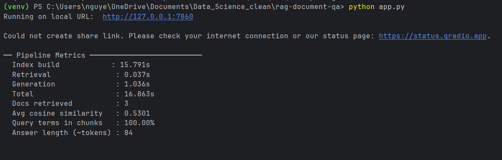
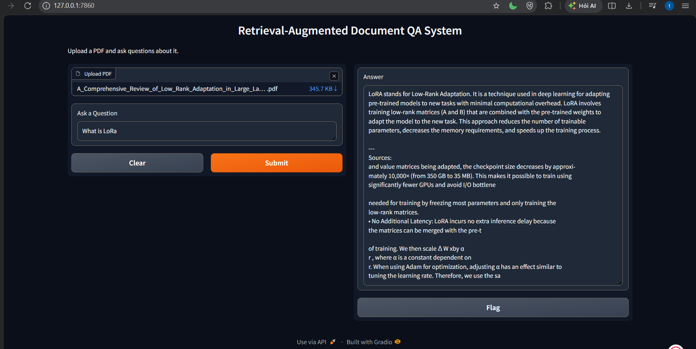

#  RAG Document Question Answering System

A Retrieval-Augmented Generation (RAG) application that allows users to upload PDF documents and ask questions about them. The system retrieves relevant text chunks via vector similarity search and generates answers using a large language model.

---

##  Features

- Upload and process PDF documents
- Automatic text chunking with overlap
- Vector similarity search with FAISS
- Retrieval-Augmented Generation (RAG)
- In-memory vector database caching for repeated queries
- Retrieval and pipeline performance metrics printed to terminal
- Interactive Gradio web interface
- Source snippets included with generated answers
- Grounded responses based on retrieved document content

---

##  Architecture

1. **Document Upload** — PDF parsed with PyPDFLoader
2. **Text Chunking** — Recursive character splitting (1000-character chunks, 200-character overlap)
3. **Embedding Generation** — `all-MiniLM-L6-v2` via HuggingFace
4. **Vector Storage** — FAISS in-memory index using normalized embeddings
5. **Similarity Retrieval** — Top-3 chunks using maximum inner product / cosine similarity
6. **Vector Cache** — Previously processed PDFs are cached in memory to avoid rebuilding the index
7. **LLM Response Generation** — Groq (Llama 3.1 8B)
8. **Source Output** — Retrieved document snippets are appended to the generated answer

---

##  Tech Stack

| Component | Tool |
|---|---|
| Framework | LangChain |
| LLM | Groq — `llama-3.1-8b-instant` |
| Embeddings | HuggingFace `all-MiniLM-L6-v2` |
| Vector Store | FAISS |
| PDF Loader | PyPDFLoader |
| Text Splitter | RecursiveCharacterTextSplitter |
| UI | Gradio |
| Language | Python 3.11 |

---

## Project Structure

```
rag-document-qa/
│
├── modules/
│   ├── __init__.py
│   ├── document_loader.py
│   ├── embeddings.py
│   ├── llm.py
│   ├── rag_pipeline.py
│   ├── text_splitter.py
│   └── vector_store.py
│
├── DEMO/
│   ├── dashboard.png
│   └── retrieval_metircs.png
│
├── app.py
├── README.md
└── requirements.txt
```

---

## Installation

Clone the repository

```bash
git clone https://github.com/trunnguyen/Personal-Project.git
cd rag-document-qa
```

Create and activate virtual environment

```bash
# Windows
python -m venv venv
venv\Scripts\activate

# Mac / Linux
python -m venv venv
source venv/bin/activate
```

Install dependencies

```bash
pip install -r requirements.txt
```

---

##  Environment Variables

Create a `.env` file and add your Groq API key:

```
GROQ_API_KEY=your_groq_api_key
```

Get a free API key at [console.groq.com](https://console.groq.com).

---

##  Run the Application

```bash
python app.py
```

The application will run locally at:

```
http://127.0.0.1:7860
```

The Gradio interface also attempts to create a public share link when the application is launched.

---

##  Retrieval & Pipeline Metrics

After each query, the system prints pipeline performance metrics to the terminal:

```
── Pipeline Metrics ──────────────────────────
  Index build            : 15.791s
  Retrieval               : 0.037s
  Generation              : 1.036s
  Total                   : 16.863s
  Docs retrieved          : 3
  Avg cosine similarity   : 0.5301
  Query terms in chunks   : 100.00%
  Answer length (~tokens) : 84
─────────────────────────────────────────────
```

The metrics include:

- **Index build** — Time required to load, split, embed, and build the FAISS index. If the same PDF is queried again, the cached index is reused.
- **Retrieval** — Time required to retrieve the top 3 relevant chunks.
- **Generation** — Time required for the LLM to generate the answer.
- **Total** — Total pipeline execution time.
- **Docs retrieved** — Number of document chunks retrieved.
- **Avg cosine similarity** — Average similarity score of the retrieved chunks.
- **Query terms in chunks** — Percentage of non-stopword query terms found in the retrieved content.
- **Answer length** — Approximate number of tokens in the generated answer.

The system keeps up to **8 processed PDF indexes in memory** and reuses them when the same document is queried again.



---

##  Demo



---

##  Example Workflow

1. Upload a PDF document
2. Ask a question about the document
3. The system builds or retrieves the cached FAISS index
4. The top 3 most relevant chunks are retrieved
5. The LLM generates an answer using the retrieved context
6. Relevant source snippets are appended to the answer
7. Pipeline performance metrics are printed to the terminal

---

##  Future Improvements

- Multi-document support
- Streaming responses
- Persistent vector database (ChromaDB / Pinecone)
- Hybrid search (BM25 + embeddings)
- Conversation memory
- More advanced source citation and document metadata

---
